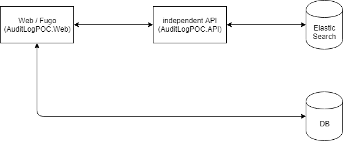

# auditLog POC



| project         | desc                                        |
| --------------- | ------------------------------------------- |
| AuditLogPOC.API | 提供 AuditLogPOC.Web 網站服務，操作相關資料 |
| AuditLogPOC.Web | 模擬 client 端介面                          |

ElasticSearch 請另行架設，可透過 ELK-Stack on docker 建立

> 需要先建立Index，並且要注意在設定檔中的url設定都要是小寫的路徑

# Web

模擬會員資料、合約資料的修改，以及異動歷程檢視

# API

接收 client 端請求，轉發 request 給實際上儲存資料的 elastic Search

## AuditLog

| API                                                        | Desc                                                         |
| ---------------------------------------------------------- | ------------------------------------------------------------ |
| GET api/AuditLog?logType={logType}&size={size}&page={page} | 查詢異動歷程紀錄，輸入 logType(類別)、size(筆數)、page(頁碼) |
| POST api/AuditLog                                          | 新增異動資料 (格式請參考說明)                                |

> logType 參數目前僅提供`customer`、`contract`測試

### 異動資料格式

`modifiedByName`、`deptName`這兩個欄位是為了測試 UI 所需要而加上，實際上中文名稱的取得應藉由 key 值向 DataBase 查詢

```json
{
  "refId": 28007357,
  "logType": "customer",
  "modifiedBy": 382388,
  "modifiedByName": "OB測試",
  "modifiedDate": "2019/04/24 06:22:16",
  "deptName": "OB部門",
  "content": [{ "field": "Mobile Phone1", "valueBefore": "0936165466", "valueAfter": "0912345" }]
}
```

## Reset

| API                              | Desc                                                   |
| -------------------------------- | ------------------------------------------------------ |
| POST api/Reset?logType={logType} | 測試用，刪除清空異動歷程資料，需帶入參數 logType(類別) |
